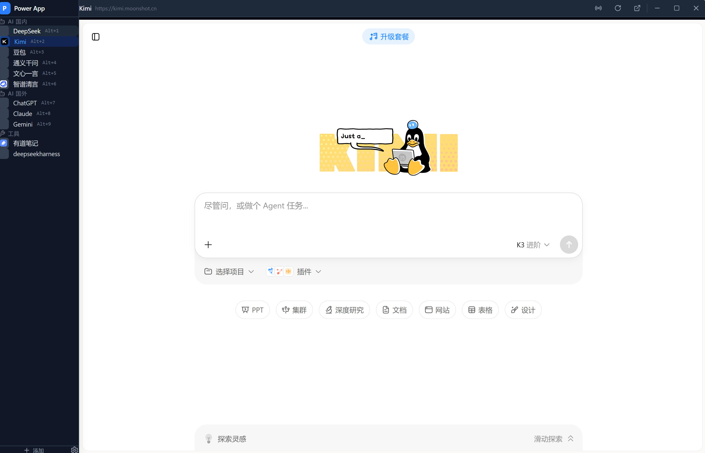
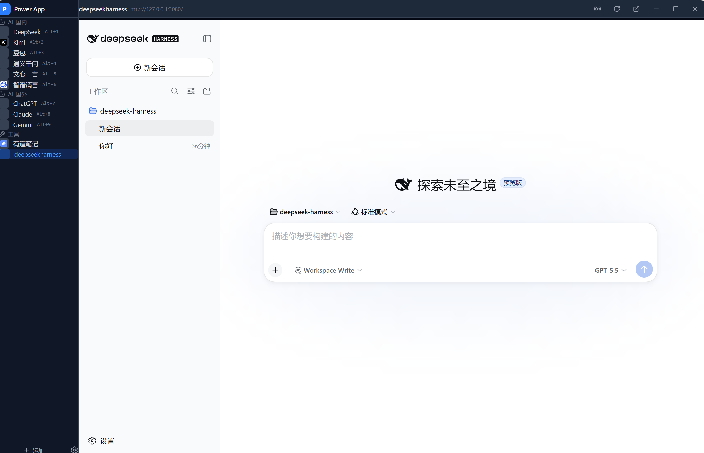

# Power App

**[English](README_EN.md)** | 中文

一站式 AI 大模型浏览器 —— 在一个窗口中集中管理多个 AI 对话网站，支持快速切换、广播消息、全局快捷键等效率功能。

## 功能特性

- **多站点集中管理** — 内置 DeepSeek、Kimi、豆包、通义千问、ChatGPT、Claude、Gemini 等主流 AI 大模型，同时支持有道笔记、DeepSeek-Harness 等 Web 工具
- **单窗口多页面切换** — 基于 Tauri 2 Child Webview 技术，所有站点在同一窗口内以原生子视图方式加载，切换无需重新打开窗口
- **广播消息** — 一条消息同时发送到多个 AI 站点，自动填充并发送（支持 textarea 和 contentEditable 两种输入模式）
- **全局快捷键** — Alt+1 ~ Alt+9 快速切换到对应站点
- **自定义标题栏** — 自定义无边框窗口 + 标题栏拖拽区域，最小化/最大化/关闭按钮符合 Windows 习惯
- **系统托盘** — 关闭窗口时最小化到系统托盘，左键点击托盘图标切换显示/隐藏
- **侧边栏拖拽调整** — 支持 160px ~ 400px 自由调整侧边栏宽度
- **站点增删改** — 支持手动添加任意 Web 应用（AI 对话、搜索、翻译、笔记、开发工具等），编辑和删除已有站点
- **站点分组** — AI 国内、AI 国外、工具、其他四组分类管理

## 界面截图

**主界面 — 侧边栏站点切换 + DeepSeek Harness 工作区**



**工作区视图 — 集成 DeepSeek Harness 本地开发工具**



> 截图展示了 Power App 将 DeepSeek Harness（`http://127.0.0.1:3080`）作为工具类站点集成的效果。左侧侧边栏可快速切换 AI 站点和工具，右侧内容区为原生 Child Webview 渲染的第三方 Web 应用。

## 技术栈

| 层级 | 技术 | 版本 |
|------|------|------|
| 框架 | [Tauri](https://tauri.app/) | 2.x (unstable feature) |
| 前端 UI | [React](https://react.dev/) | 19 |
| 语言 | TypeScript + Rust | TS 5.8 / Rust 2021 |
| 构建工具 | [Vite](https://vite.dev/) | 7.x |
| 样式 | [Tailwind CSS](https://tailwindcss.com/) | 4.x (Vite 插件) |
| 状态管理 | [Zustand](https://zustand-demo.pmnd.rs/) | 5.x |
| 图标 | [Lucide React](https://lucide.dev/) | - |
| 后端插件 | tauri-plugin-global-shortcut, tauri-plugin-opener, tauri-plugin-shell | 2.x |

## 技术架构

```
┌─────────────────────────────────────────────────────┐
│                   Tauri Main Window                  │
│  ┌──────────────────────────────────────────────┐    │
│  │              前端 React 应用                   │    │
│  │  ┌──────────┐  ┌─────────────────────────┐   │    │
│  │  │ Sidebar  │  │       TitleBar          │   │    │
│  │  │          │  ├─────────────────────────┤   │    │
│  │  │ 站点列表  │  │                         │   │    │
│  │  │ 分组管理  │  │   Content Area          │   │    │
│  │  │ 拖拽调宽  │  │   (HTML 层)             │   │    │
│  │  │          │  │                         │   │    │
│  │  └──────────┘  │                         │   │    │
│  │  ┌──────────┐  │                         │   │    │
│  │  │ Modals   │  │   ┌─────────────────┐   │   │    │
│  │  │ 设置/添加 │  │   │ Child Webview   │   │   │    │
│  │  │ 广播消息  │  │   │ (原生层, 覆盖    │   │   │    │
│  │  └──────────┘  │   │  在 HTML 之上)   │   │   │    │
│  │                │   └─────────────────┘   │   │    │
│  │                └─────────────────────────┘   │    │
│  └──────────────────────────────────────────────┘    │
│                                                      │
│  Rust Backend (WebView2Engine + WebviewManager)      │
│  ├── config/     JSON 配置持久化                       │
│  ├── engine/     浏览器引擎抽象层                       │
│  ├── manager/    Webview 生命周期管理                   │
│  ├── commands/   Tauri IPC 命令                        │
│  ├── tray.rs     系统托盘                              │
│  └── shortcuts   全局快捷键注册                         │
└─────────────────────────────────────────────────────┘
```

### 核心设计：单窗口 + Child Webview

传统多窗口方案（每个站点一个 OS 窗口）存在任务栏混乱、资源占用高等问题。Power App 采用 **单窗口 + Tauri 2 Child Webview** 方案：

1. 应用仅创建一个 Tauri `Window`（主窗口），前端 React 渲染侧边栏和标题栏
2. 每个 AI 站点作为 **Child Webview** 通过 `Window::add_child()` 添加到主窗口的内容区域
3. 切换站点时，通过 `show()` / `hide()` 控制 Child Webview 的显示/隐藏，实现**即时切换、页面不丢失**
4. 新增/删除站点时，动态创建/销毁 Child Webview，无需重启应用

### 数据流

```
前端 React ──invoke()──▶ Tauri IPC ──▶ Rust Commands ──▶ WebviewManager ──▶ WebView2Engine
     │                                                       │
     └────────────── loadSites() ◀── get_sites ──────────────┘
```

## 项目结构

```
power-app/
├── src/                          # 前端 React 应用
│   ├── App.tsx                   # 根组件（侧边栏 + 标题栏 + 弹窗）
│   ├── main.tsx                  # 入口
│   ├── index.css                 # Tailwind 入口
│   ├── types/index.ts            # TypeScript 类型定义
│   ├── stores/appStore.ts        # Zustand 全局状态
│   ├── hooks/useShortcuts.ts     # 快捷键 Hook
│   └── components/
│       ├── Sidebar/              # 侧边栏（站点列表、分组、拖拽调宽）
│       ├── TitleBar/             # 自定义标题栏（站点信息、功能按钮、窗口控制）
│       ├── Settings/             # 设置弹窗（主题、站点管理）
│       ├── AddSite/              # 添加/编辑站点弹窗
│       └── Broadcast/            # 广播消息弹窗
│
├── src-tauri/                    # 后端 Rust 应用
│   ├── Cargo.toml
│   ├── tauri.conf.json           # Tauri 配置（窗口、打包）
│   ├── capabilities/default.json # 权限配置
│   └── src/
│       ├── lib.rs                # 应用入口、初始化、事件监听
│       ├── main.rs               # 二进制入口
│       ├── tray.rs               # 系统托盘（左键切换、右键菜单）
│       ├── shortcuts.rs          # 全局快捷键注册
│       ├── config/
│       │   ├── mod.rs            # ConfigManager（JSON 读写持久化）
│       │   └── models.rs         # 数据模型（SiteConfig, AppConfig）
│       ├── engine/
│       │   ├── mod.rs            # BrowserEngine trait 抽象
│       │   └── webview2.rs       # WebView2 引擎实现
│       ├── manager/
│       │   ├── mod.rs
│       │   └── webview_manager.rs # Webview 生命周期管理器
│       └── commands/
│           ├── mod.rs
│           ├── site_commands.rs   # 站点 CRUD 命令
│           └── view_commands.rs   # 视图操作命令
│
├── package.json
├── tsconfig.json
├── vite.config.ts
└── README.md
```

## 快速开始

### 环境要求

- [Node.js](https://nodejs.org/) >= 18
- [Rust](https://www.rust-lang.org/tools/install) >= 1.70
- [Tauri Prerequisites](https://v2.tauri.app/start/prerequisites/) (Windows: WebView2 Runtime, MSVC)

### 安装依赖

```bash
npm install
```

### 开发模式

```bash
npm run tauri dev
```

### 构建 Release

```bash
npm run tauri build
```

构建产物位于 `src-tauri/target/release/bundle/`：
- `msi/` — Windows MSI 安装包
- `nsis/` — NSIS 安装向导

## 配置

应用配置保存在：

```
Windows: C:\Users\<用户名>\AppData\Roaming\com.gcyai.power-app\config.json
```

### 内置站点

| 站点 | 快捷键 | 分组 |
|------|--------|------|
| DeepSeek | Alt+1 | AI 国内 |
| Kimi | Alt+2 | AI 国内 |
| 豆包 | Alt+3 | AI 国内 |
| 通义千问 | Alt+4 | AI 国内 |
| 文心一言 | Alt+5 | AI 国内 |
| 智谱清言 | Alt+6 | AI 国内 |
| ChatGPT | Alt+7 | AI 国外 |
| Claude | Alt+8 | AI 国外 |
| Gemini | Alt+9 | AI 国外 |
| 有道笔记 | - | 工具 |

### 推荐集成站点

Power App 不仅限于 AI 对话，任何 Web 应用都可以作为站点集成进来。以下是一些推荐场景：

| 场景 | 站点 | 地址 | 说明 |
|------|------|------|------|
| 搜索 | Google | `https://www.google.com` | 通用搜索 |
| 搜索 | Perplexity | `https://www.perplexity.ai` | AI 搜索引擎 |
| 翻译 | DeepL | `https://www.deepl.com/translator` | 高质量 AI 翻译 |
| 翻译 | Google 翻译 | `https://translate.google.com` | 多语言翻译 |
| 翻译 | 百度翻译 | `https://fanyi.baidu.com` | 中英翻译 |
| 笔记 | Notion | `https://www.notion.so` | 协作笔记与知识库 |
| 笔记 | 有道笔记 | `https://note.youdao.com` | 国内云笔记（已内置） |
| 图表 | Excalidraw | `https://excalidraw.com` | 手绘风格白板 |
| 图表 | draw.io | `https://app.diagrams.net` | 流程图/架构图 |
| 开发 | GitHub | `https://github.com` | 代码托管 |
| 开发 | Stack Overflow | `https://stackoverflow.com` | 技术问答 |
| 开发 | DeepSeek-Harness | `http://127.0.0.1:3080` | 本地开发工具 |
| 写作 | 笔灵 | `https://ibiling.cn` | AI 写作助手 |
| 设计 | Canva | `https://www.canva.com` | 在线设计工具 |

> **提示**：点击侧边栏底部「添加」按钮，输入名称和网址即可集成任意 Web 应用。

### Tauri 命令（IPC）

| 命令 | 说明 |
|------|------|
| `get_sites` | 获取所有站点配置 |
| `add_site` | 添加站点 |
| `update_site` | 更新站点信息 |
| `delete_site` | 删除站点并销毁 webview |
| `switch_view` | 切换到指定站点的 webview |
| `create_view` | 动态创建新的 child webview |
| `navigate_view` | 导航 webview 到新 URL |
| `reload_view` | 刷新当前 webview |
| `broadcast_message` | 向多个站点广播消息 |
| `hide_all_views` | 隐藏所有 child webview |
| `update_sidebar_width` | 更新侧边栏宽度并调整 webview 布局 |

## 许可证

MIT
